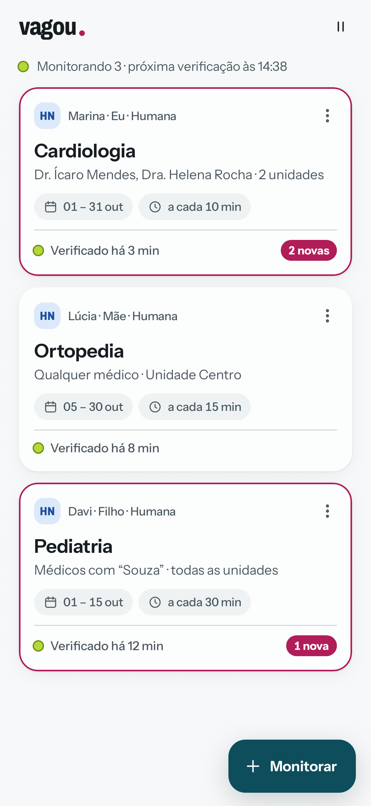
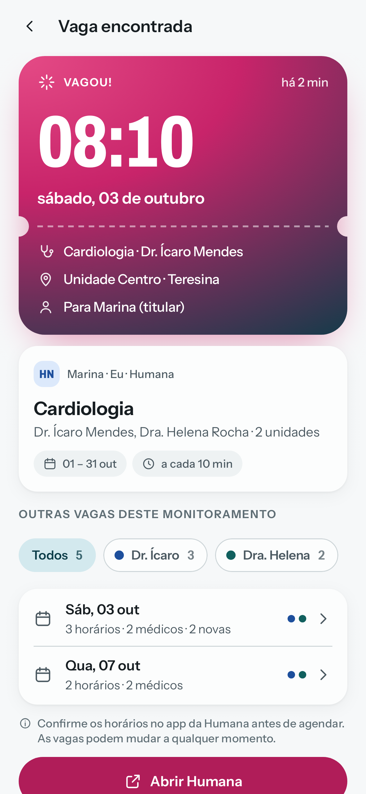
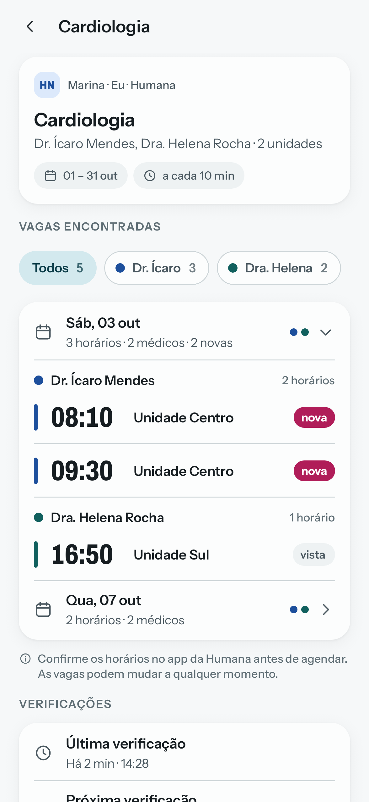
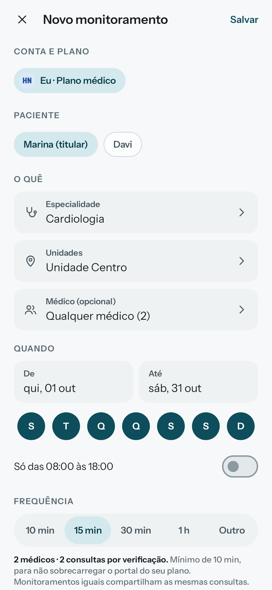
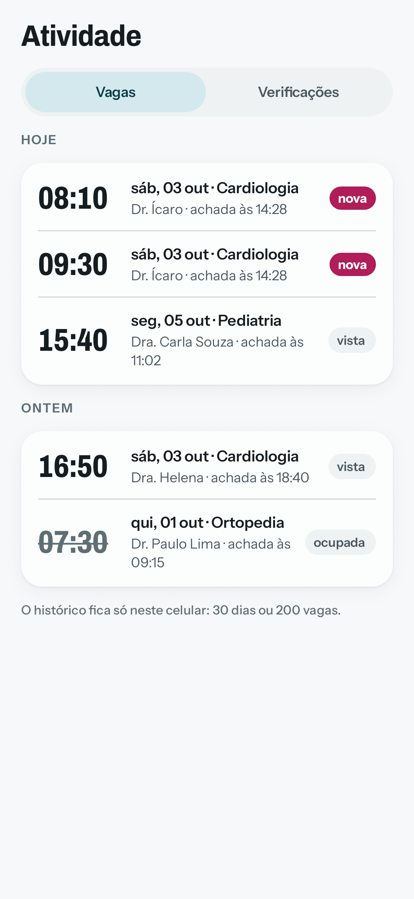
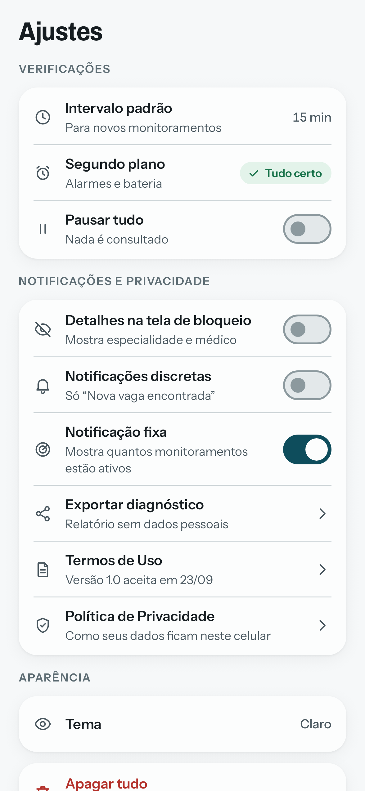

# Vagou

O Vagou avisa no seu celular quando abre um horário com o médico que você quer no seu plano de saúde.

<p align="center">
  
  
  
</p>
<p align="center">
  
  
  
</p>

## O que faz

- Monitora a agenda do seu plano por especialidade e unidade, com os médicos que você escolher, qualquer médico ou quem tiver um nome que você digitar.
- Limita a busca por datas, dias da semana e horário.
- Verifica em segundo plano, mesmo com o app fechado, e avisa assim que surge uma vaga, com um atalho para o app oficial do plano.
- Mostra as vagas encontradas por dia e por médico, e o histórico do que foi verificado.
- Avisa quando a conta precisa de você (senha que não confere, conta bloqueada) ou quando o portal do plano está fora do ar.

## Privacidade

Tudo roda no seu celular: sem servidor, sem cadastro, sem telemetria, anúncios ou rastreadores. Senhas e dados ficam
criptografados com uma chave do Android Keystore e fora dos backups. O Vagou só se conecta aos endereços oficiais do
plano.

## Planos

- Humana Saúde Nordeste (piloto)

## Download

As versões vão ser publicadas em [Releases](../../releases), com o APK e o arquivo `SHA256SUMS`. Ainda não há versões
publicadas aqui.

Para conferir um APK baixado:

```bash
shasum -a 256 -c SHA256SUMS
apksigner verify --print-certs vagou-X.Y.Z.apk
```

O certificado de assinatura oficial tem o SHA-256
`841f6c459fb4785baba52e9de745a8ee6288dd87aee56d8fe57f0fc8fdcb41c4`. Qualquer outro valor significa que o arquivo não é
uma versão oficial do Vagou.

## Aviso

O Vagou é um projeto independente e não é afiliado, patrocinado ou endossado pela Humana Saúde ou por qualquer
operadora. As telas acima usam dados fictícios. Os horários vêm do portal do plano: confirme sempre no app oficial antes
de agendar.

Este repositório só divulga o app (telas, novidades e downloads). O código-fonte é privado.
